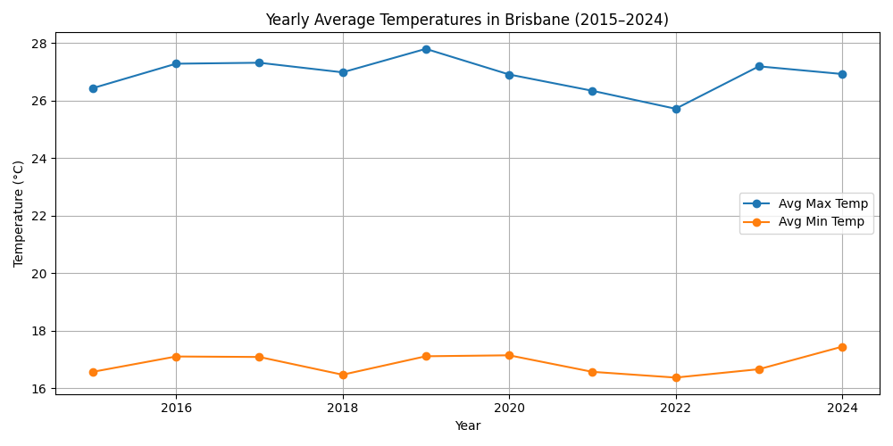
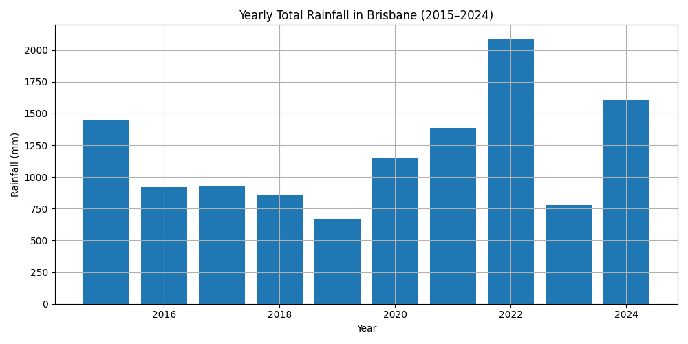
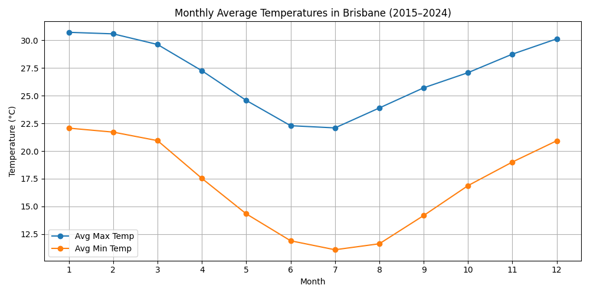
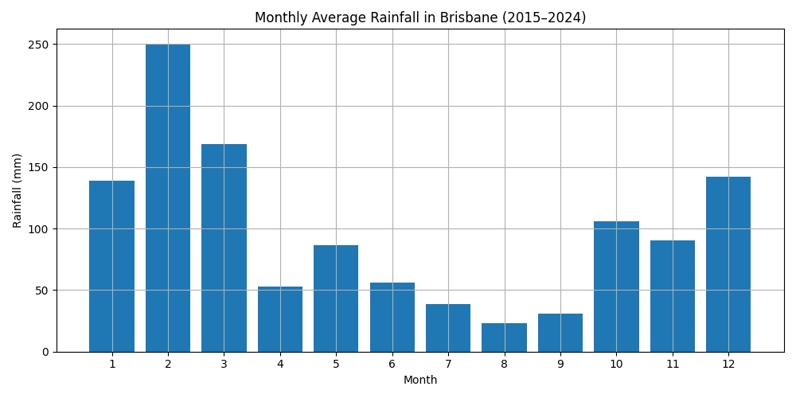
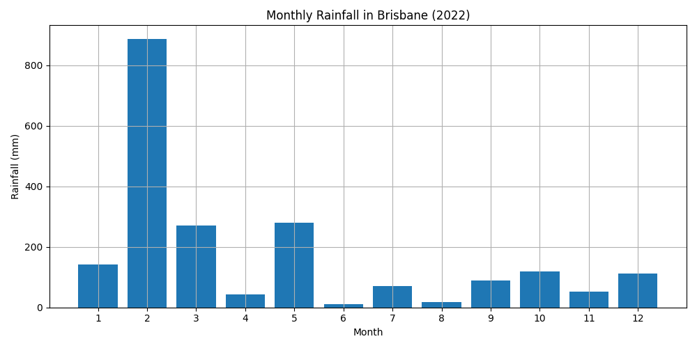

# 🌤️ Brisbane Climate Trends Analysis (2015–2024)

## 📌 Overview
This project analyzes Brisbane’s climate trends over the last decade (2015–2024) using publicly sourced weather data from the Australian Bureau of Meteorology (BOM).  
The analysis focuses on long-term trends in temperature and rainfall, and highlights extreme weather events such as floods.

## 🎯 Objectives
- Visualize yearly and monthly changes in temperature and rainfall
- Detect seasonal weather patterns
- Identify climate anomalies and explain their causes (e.g., the 2022 floods)
- Practice real-world data analysis using Python

## 🛠️ Tools Used
- Python 3.11
- pandas
- matplotlib
- Visual Studio Code

## 📊 Key Visualizations

1. **Yearly Average Temperatures (2015–2024)**  
   → Line chart showing trends in yearly Avg Max / Min Temperatures  
   

2. **Yearly Total Rainfall (2015–2024)**  
   → Bar chart showing total annual rainfall  
   

3. **Monthly Average Temperatures (2015–2024)**  
   → Clear seasonal temperature pattern over 10 years  
   

4. **Monthly Average Rainfall (2015–2024)**  
   → Seasonal rainfall trends visualized over a decade  
   

5. **Monthly Rainfall in 2022**  
   → Unusually high rainfall observed in February; potential cause of flooding  
   

## 📈 Insights Summary

- 🔥 **Stable Temperature Trends**  
  Brisbane’s average maximum temperature remained mostly stable, ranging from ~26.5°C to 28°C over 10 years. Minimum temperatures also fluctuated slightly but consistently.

- 🌦️ **Clear Seasonality**  
  Summers (Dec–Feb) were hot and wet, while winters (Jun–Aug) were cooler and drier. February consistently recorded the highest rainfall.

- 🌊 **Extreme Rainfall Event in 2022**  
  February 2022 recorded over 880 mm of rain — the highest in the dataset — which led to major flooding in South East Queensland.  
  According to BOM and IGEM reports, a stalled low-pressure system caused continuous heavy rainfall, breaking historical records and flooding thousands of homes.

- 📉 **Dryest Year: 2019**  
  In contrast, 2019 recorded the lowest annual rainfall, under 700 mm — showing the impact of climate variability.

- 📌 **Why It Matters**  
  Long-term climate data is essential for understanding patterns, preparing for extreme events, and making informed decisions in city planning and disaster management.

## 📁 Folder Structure
brisbane-climate-analysis/
│
├── data/
│ └── brisbane_climate_2015_2024.csv
│
├── images/
│ ├── 1_yearly_avg_temp.png
│ ├── 2_yearly_total_rainfall.png
│ ├── 3_monthly_avg_temp.png
│ ├── 4_monthly_avg_rainfall.png
│ └── 5_rainfall_2022.png
│
├── analysis/
│ └── climate_analysis.py
│
├── README.md
└── requirements.txt

